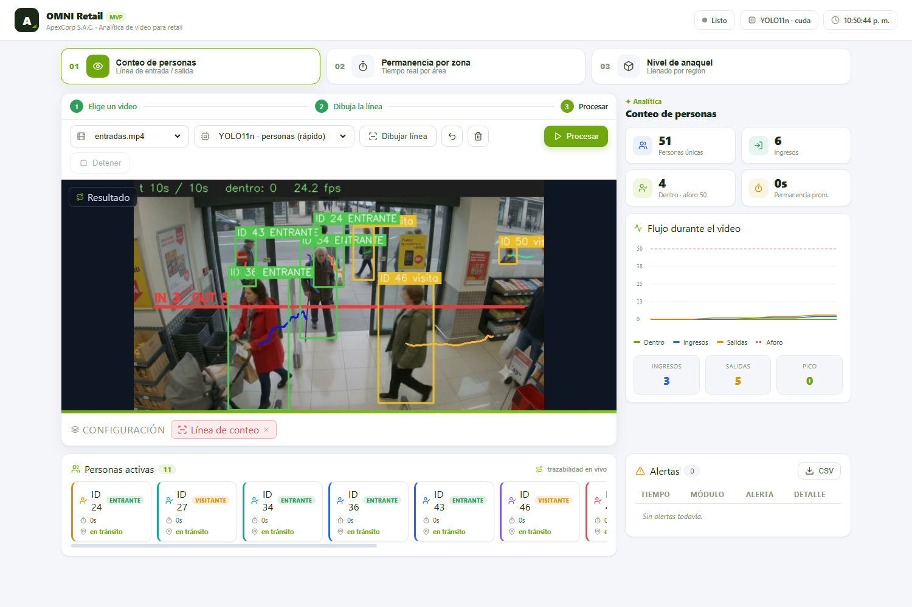
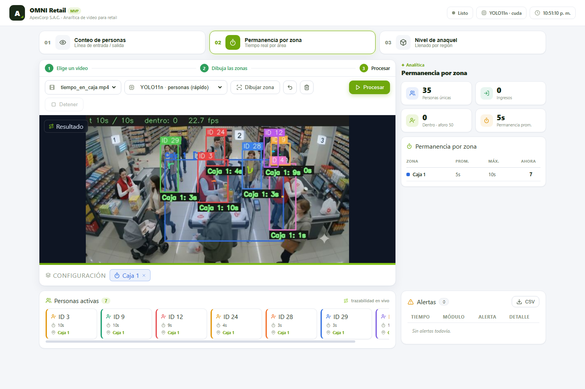
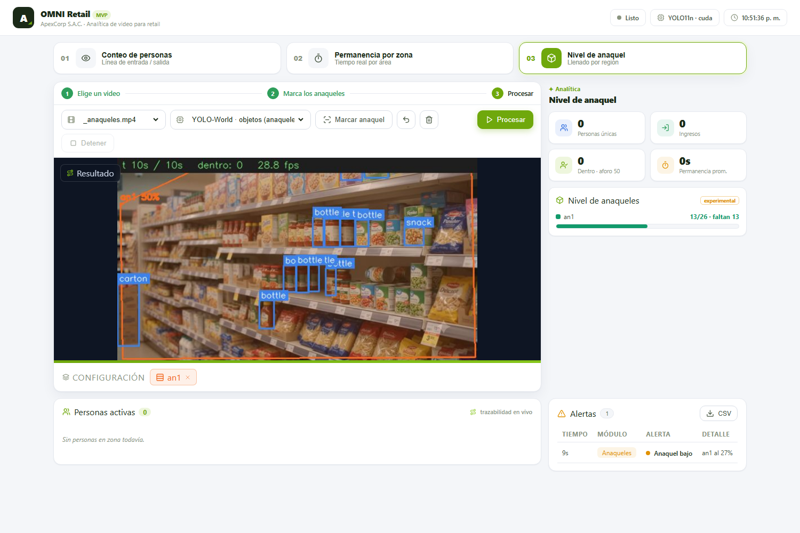
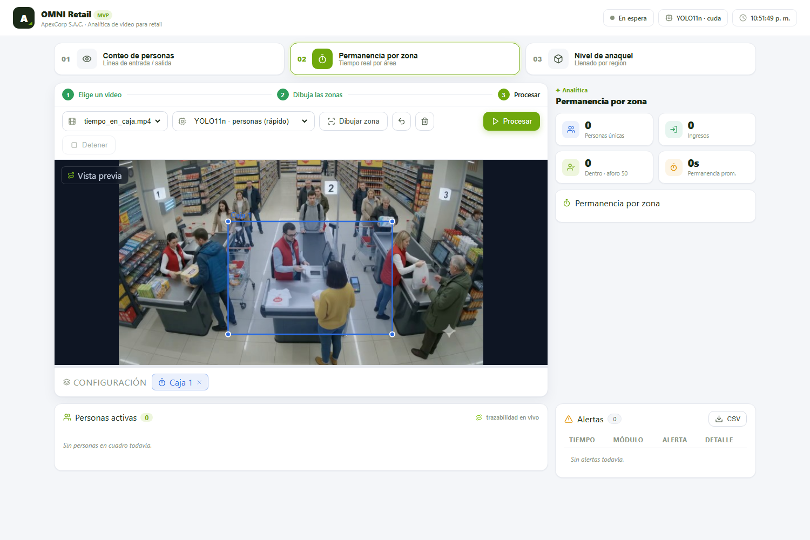
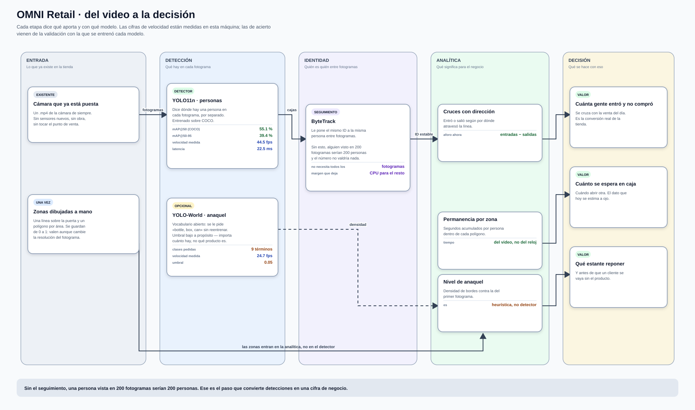
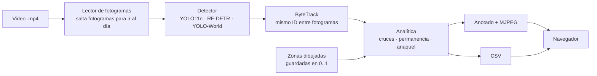
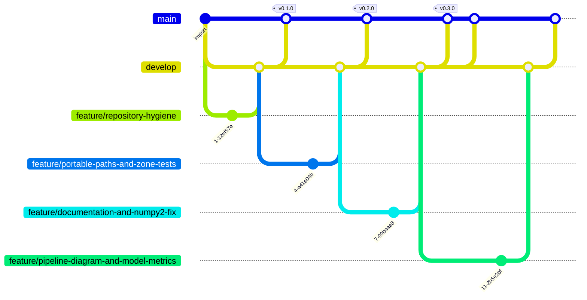

# OMNI Retail — analítica de video para tienda

> **Visión computacional · YOLO11 + RF-DETR + ByteTrack · FastAPI · CUDA o CPU**
>
> 
> 
> 
> 



## El problema

Una tienda sabe cuánto vendió. No sabe **cuánta gente entró y no compró**,
cuánto esperó en caja, ni cuándo se vació un anaquel. Esos tres datos ya están
en las cámaras que la tienda ya tiene instaladas — solo que nadie los mira.

OMNI Retail los saca del video. No hay hardware nuevo, no hay sensores: el
mismo `.mp4` de la cámara de siempre entra por un lado y por el otro salen
cifras y un CSV.

| Módulo | Qué responde | Con qué |
|---|---|---|
| **Conteo** | ¿Cuánta gente entró y cuánta salió? ¿Cuánta hay dentro ahora? | Una línea dibujada sobre la puerta; se cuentan los cruces con dirección |
| **Permanencia** | ¿Cuánto tarda alguien en la cola de caja? ¿Y en cada zona? | Polígonos por área; se acumulan segundos por persona seguida |
| **Anaqueles** | ¿Qué estante se está vaciando? | Densidad de bordes del anaquel frente a la del primer fotograma |

Las cifras salen del procesamiento real del video. No hay datos simulados en
ninguna captura de este README.

## Qué se ve

| | |
|---|---|
| **Conteo de entradas y salidas**<br><br><sub>51 personas únicas en 10 s de video; IN y OUT sobre la línea roja</sub> | **Permanencia en caja**<br><br><sub>segundos acumulados por persona dentro de la zona «Caja 1»</sub> |
| **Nivel de anaquel**<br><br><sub>llenado por región frente al primer fotograma</sub> | **Editor de zonas**<br><br><sub>se dibuja una vez por cámara; queda guardado en data/zones/</sub> |

## Cómo funciona

<a href="docs/flujo.svg">
  
</a>

<sub>Ábrelo en grande: <a href="docs/flujo.svg"><code>docs/flujo.svg</code></a>.
Las cifras de las tarjetas no están escritas a mano — las pone
<a href="scripts/diagrama.py"><code>scripts/diagrama.py</code></a> leyendo
<code>docs/modelos.json</code>, que a su vez genera
<a href="scripts/medir_modelos.py"><code>scripts/medir_modelos.py</code></a>
midiendo los modelos de verdad. Si mañana se cambia un modelo, se corren los
dos y el dibujo se corrige solo.</sub>

### El mismo recorrido, en corto



El detalle que hace que esto funcione en tiempo real: **el seguimiento no
necesita todos los fotogramas**. ByteTrack mantiene la identidad saltando
fotogramas, y bajar la cadencia deja margen de CPU para el resto. Es la misma
lección que dejó `vision-node`.

Las zonas se guardan **normalizadas de 0 a 1**, no en píxeles. Así el mismo
polígono cae en la misma parte de la imagen aunque el fotograma se reescale, y
dibujarlas es cosa de una vez por cámara.

<!-- MODELOS:inicio -->

### Los modelos, medidos

| Modelo | Para qué | Entrada | Precisión | Recall | mAP@50 | mAP@50-95 |
|---|---|---|---|---|---|---|
| **`yolo11n.pt`** | Personas — detector por defecto | 640² | 65.6 % | 50.2 % | 55.1 % | 39.4 % |
| **`yolov8s-world.pt`** | Objetos de anaquel (vocabulario abierto) | 640² | — | — | — | — |

<sub>Estas cuatro columnas **no** se calculan aquí: salen del propio archivo `.pt`, donde Ultralytics guarda la validación del entrenamiento que produjo esos pesos. Son el acierto sobre el conjunto de validación de quien lo entrenó, **no** sobre los videos de este proyecto. Medir eso exigiría etiquetar a mano esta operación concreta, que es trabajo que un MVP todavía no ha hecho; dar un porcentaje inventado sería peor que no darlo. Comprobación de que la lectura es correcta: `yolo11n` sale con mAP@50-95 = 39,4 % y Ultralytics publica 39,5 % para ese modelo en COCO.</sub>

### De dónde sale cada modelo

| Modelo | Entrenado sobre | Épocas | Resolución | Origen |
|---|---|---|---|---|
| **`yolo11n.pt`** | `coco` | 600 | 640×640 | [Ultralytics · COCO 2017](https://docs.ultralytics.com/models/yolo11/) |
| **`yolov8s-world.pt`** | `—` | 100 | 640×640 | [Ultralytics YOLO-World](https://docs.ultralytics.com/models/yolo-world/) |

<sub>El conjunto, las épocas y la resolución salen de `train_args`, que Ultralytics guarda dentro del propio `.pt`. Es decir: no es lo que dice la documentación del modelo, es lo que quedó grabado en el archivo que este repositorio usa de verdad. Los nombres de conjunto son los del disco de quien entrenó —`retrain_data`, `safe_human`— porque es literalmente lo que hay dentro.</sub>

| Modelo | Parámetros | Clases | Latencia (mejor) | Latencia (mediana) | Det./fotograma | Confianza media |
|---|---|---|---|---|---|---|
| **`yolo11n.pt`** | 2.6 M | 80 | 17.7 ms · 56 fps | 23.3 ms · 42.9 fps | 5.0 | 0.683 |
| **`yolov8s-world.pt`** | 13.4 M | 80 | 27.7 ms · 36 fps | 38.8 ms · 25.7 fps | 19.2 | 0.144 |

<sub>Esto sí se mide aquí, con <a href="scripts/medir_modelos.py"><code>scripts/medir_modelos.py</code></a>, sobre fotogramas reales de los videos del repositorio, en una RTX 3060 Laptop y a la resolución que usa la aplicación. Sesenta fotogramas, descartando los veinte primeros.<br>Se dan <b>dos</b> latencias a propósito. Esta GPU está a 210 MHz en reposo y tarda segundos en subir de reloj, así que la mediana se mueve bastante entre pasadas —el mismo <code>yolo11n</code> ha dado 20 y 48 fps— mientras que el mejor caso es estable y representa lo que la máquina puede sostener. Dar solo la cifra buena sería vender de más; dar solo la mediana, castigar al modelo por la gestión de energía del portátil.</sub>

<!-- MODELOS:fin -->

## Probarlo

```bash
pip install -r requirements.txt
python download_models.py
python -m uvicorn backend.main:app --port 8010
```

Abre <http://localhost:8010>, elige un video, dibuja la línea o las zonas sobre
el primer fotograma y pulsa **Procesar**.

### Por qué los pesos y los videos no están aquí

No son código: son la entrada y la salida del sistema. Varios pasan de los
100 MB que GitHub rechaza de plano, y clonar el proyecto pasaría de segundos a
minutos para traerse archivos que se regeneran o se descargan.

```bash
python download_models.py          # los recupera y dice cuáles faltan
```

## Cómo está montado

```
backend/
├── config.py     todo por variable de entorno, sin tocar código
├── detector.py   los tres detectores, cargados solo cuando se usan
├── processor.py  el bucle: leer, detectar, seguir, anotar, emitir
├── analytics.py  detecciones → cifras: cruces, permanencia, anaquel
├── zones.py      polígonos y línea, guardados en 0..1 por video
├── compat.py     el parche de NumPy 2 (ver «Pruebas»)
└── main.py       API y streaming MJPEG
frontend/         interfaz sin framework: HTML, CSS y un app.js
scripts/          generadores de las capturas y del diagrama de ramas
data/zones/       zonas ya dibujadas para los videos de ejemplo
```

## Ajustes (`.env`)

| Clave | Para qué |
|---|---|
| `DETECTOR` | `yolo`, `rfdetr` o `yoloworld` |
| `DEVICE` | `cuda` o `cpu` |
| `WORK_RES` | Resolución de inferencia — bajarla da fluidez |
| `LINE_CROSS_MIN` | Fotogramas al otro lado para dar el cruce por bueno |
| `DWELL_ALERT_SEC` | Segundos de permanencia que disparan alerta |
| `STORE_CAPACITY` | Aforo, para la línea de referencia del gráfico |
| `SHELF_ALERT_PCT` | Porcentaje de llenado que se considera bajo |

## Pruebas

```bash
python -m pytest -q          # 19, sin video ni modelos ni GPU
```

**`test_conteo.py` existe por un fallo que no se veía.** NumPy 2.0 eliminó el
producto vectorial de dos dimensiones, y `supervision.LineZone` lo usaba por
dentro: en cuanto la primera persona entraba en cuadro, el hilo de
procesamiento moría con una excepción que solo salía por la consola del
servidor. Desde el navegador no se veía nada — se quedaba en «Procesando…» con
el contador a cero, para siempre. Parecía un video lento.

Está arreglado en `backend/compat.py`, y estas pruebas se ponen rojas si el
parche deja de aplicarse. No se fijó la versión de NumPy porque el intérprete
es el mismo para los cinco MVPs y torch está compilado contra esta: bajarla
arreglaría el conteo y rompería la inferencia.

`test_zones.py` cubre `zones.py`, que es donde un nombre que llega por HTTP
acaba nombrando un archivo en disco — la forma exacta que tiene un salto de
directorio.

<!-- GITFLOW:inicio -->

## Cómo se trabajó

**15 commits**, **9 fusiones** y **3 etiquetas** (`v0.1.0`, `v0.2.0`, `v0.3.0`). al generar este bloque. Cada rama entra con `--no-ff`: un merge aplastado ahorra una línea y borra la única prueba de que aquello fue una tarea con principio y final.



| Prefijo | Para qué | Ramas |
|---|---|---|
| `develop/` | rama de integración | 5 |
| `feature/` | trabajo acotado, se integra en develop | 4 |

| Rama | Responsabilidad | Regla de salida |
|---|---|---|
| `main` | Lo que ve primero quien llega al repositorio | Solo recibe trabajo terminado y con las pruebas en verde |
| `develop` | Integración: aquí se junta todo antes de subir | Merge `--no-ff` desde una rama `feature/*` |
| `feature/*` | Un trabajo acotado, nombrado por lo que hace | Merge `--no-ff` a `develop` con sus pruebas escritas |

Los mensajes siguen *Conventional Commits* y están en inglés. Explican **por qué**, no qué: el *qué* ya está en el diff. Varios cuentan el fallo que arreglan y cómo se descubrió, que es lo que sirve dentro de seis meses.

<sub>El diagrama lo genera <a href="scripts/gitflow.py"><code>scripts/gitflow.py</code></a> leyendo <code>git log --merges</code>.</sub>

<!-- GITFLOW:fin -->

---

## Licencia

Uso interno de ApexCorp S.A.C.

<sub>OMNI Retail · ApexCorp S.A.C. — desarrollado por
<a href="https://github.com/danielyatacoblas">Daniel Yataco Blas</a></sub>
